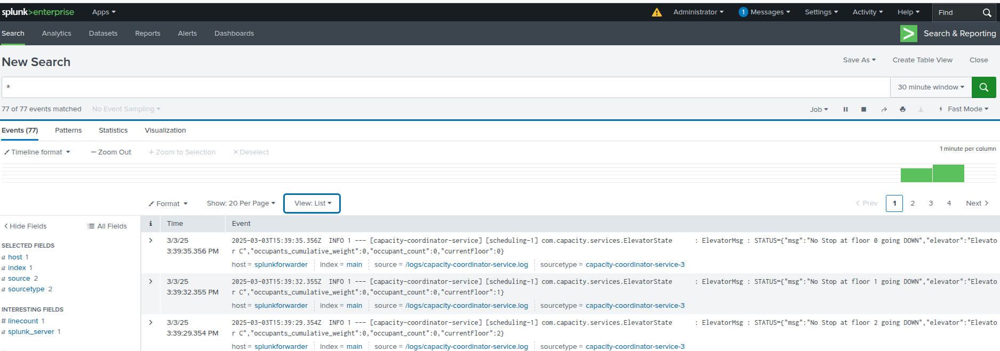

# Liftinator Monorepo


### Table of Contents
- [Tech Stack](#-tech-stack)
- [About](#-about)
- [Architecture](#diagram)
- [Links](#links)
- [Basic Setup](#-basic-setup)
- [Docker Setup](#-docker-setup)
- [Splunk Setup](#-splunk)
- [Testing](#-test)


## 💡 Tech Stack <a name="tech-stack"></a>
[](https://skillicons.dev)

## 🚀 About <a name="about"></a>

**Liftinator** is a fun opportunity to design, build, and test an elevator system. The concept seemed simple at first—just a basic elevator that could move between different floors—but I quickly realized it was an engaging exercise that required deep problem-solving, technical knowledge, and innovation. I would suggest starting with the [design document](./files/Liftinator_HLD.docx), which gives an overview of the design and thought process when building the Lifinator. After cloning the repository, there are two ways to run the project.

- **Basic Setup**: Basic setup is running install on the base **pom.xml** and then starting the services one at a time. This would get everything up and running fairly quickly.
- **Docker Setup**: Docker setup is deploying via Docker. An added bonus of running via the Docker container is that you can view the system via a Splunk dashboard.

### 🏛️ The Solution Architecture <a name="diagram"></a>
<p align="center">
  
</p>

### 🔎 Links <a name="links"></a>

| Link                                                                                          | Description                                       |
|-----------------------------------------------------------------------------------------------|---------------------------------------------------|
| [High Level Design Document](./files/Liftinator_HLD.docx)                                     | High level design document for Liftinator project |
| [Spunk](http://localhost:8000/)                                                               | Local running Splunk login                        |
| [Swagger API](http://localhost:8081/swagger-ui/index.html)                                    | Local running swagger for API endpoints           |

## 📝 Basic Setup <a name="basic-setup"></a>
For basic setup, follow these steps:

* Clone the repository.
* Run **maven install** on the **pom.xml** the root directory of the project. This should first build **common-libs** and then build the **capacity-coordinator-service** and **edge-service**. If everything builds correctly you should see:
<p align="center">
  
</p>

* Run the spring services **capacity-coordinator-service** and **edge-service** under the **/apps** folder.
* With the services up you can now use the **http-request_demo.http** file in the base directory to send API commands to run elevator requests and view the log output.

## [](https://skillicons.dev) Docker Setup <a name="docker-setup"></a>
For docker setup, you must have Docker installed. 
* Clone the repository.
* Run the **docker-compose.yaml** in the base directory. This will:
    1. Pull the docker images for the **capacity-coordinator-service** and **edge-service**
    2. Pull the docker images for **splunk** and **splunk/universalforwarder**
    3. Start all four containers. <br>
       ⭐ **Note:** Splunk server usually takes a few minutues to come up. Please be patient.


### 📃 Splunk Setup <a name="splunk"></a>
If you did **docker setup** you should have a splunk sever running and can [login](http://localhost:8000/). (admin/password)
* As you run the tests (below), within **Splunk** select **Search** tab, and in the search field, search for all "*".

<p align="center">
  
</p>

* For a more visual view of the data, you can also use a dashboard by going to **Dashboards** and then:
    1. Select **Create New Dashboard** (name it whatever you like), then select **Dashboard Studio** and **Grid**.
    2. Select **Add Chart** (top bar) and choose **Table**, then in **Create Search** for the query enter the contents from **splunkQuery.txt**.

* If all goes well, you should see a table, and when you run the tests below, you should see something similar to:

<p align="center">
  
</p>

### 🧪 Testing <a name="test"></a>

**Scenario:** The scenario for the tests is a 15-story building with 6 elevators (A-F), where each elevator can support a maximum load of 800 lbs. 
The **http-request_demo.http** file (located in the base directory) is used to post API requests that specify how many people are requesting elevators and the details for each person. 
For each person waiting, we specify:
```shell
  {
      "currentFloor": 0,  //Floor the person is currenty on
      "floorSelected": 3, //Floor the need to get to
      "name": "David",    //Person Name
      "weight": 145       //Persons weight (which contribues to the load in the elevator)
  }

```

