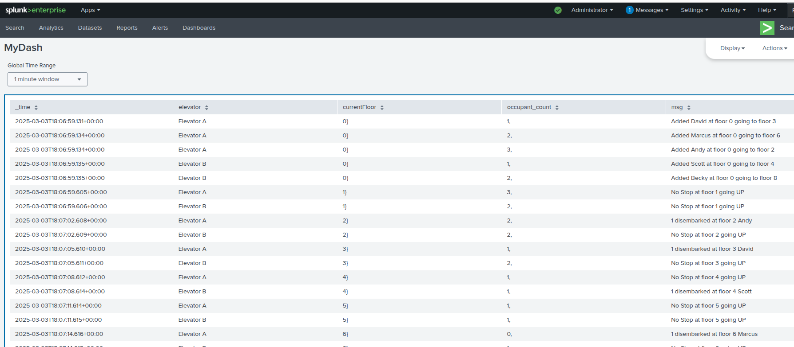

# Liftinator Monorepo

### Table of Contents
- [About](#-about)
- [Architecture](#diagram)
- [Links](#links)
- [Basic Setup](#-basic-setup)
- [Docker Setup](#-docker-setup)

## 🚀 About

**Liftinator** is a fun opportunity to design, build, and test an elevator system. The concept seemed simple at first—just a basic elevator that could move between different floors—but I quickly realized it was an engaging exercise that required deep problem-solving, technical knowledge, and innovation. I would suggest starting with the [design document](), which gives an overview of the design and thought process when building the Lifinator. After cloning the repository, there are two ways to run the project.

- **Basic Setup**: Basic setup is running install on the base **pom.xml** and then starting the services one at a time. This would get everything up and running fairly quickly.
- **Docker Setup**: An Docker setup is deploying via Docker. An added bonus of running via a Docker container is that you can view the system via the Splunk dashboard.

### Architecture Diagram 

  

### Links 

| Link                           | Description                                       |
|--------------------------------|---------------------------------------------------|
| [High Level Design Document]() | High level design document for Liftinator project |
| [Spunk]()                      | Local running Splunk login                        |
| [Swagger API]()                | Swagger for API endpoints                         |

## 📝 Basic Setup
For basic setup, follow these steps:

* Clone the repository.
* Run **maven install** on the **pom.xml** the root directory of the project. This should first build **common-libs** and then build the **capacity-coordinator-service** and **edge-service**. If everything builds ok you should see:

  

* Run the spring services **capacity-coordinator-service** and **edge-service**  under **/apps** folder.
* With the services up you can now use the **http-request_demo.http** file in the base directory to send API commonds to run elevator requests.

## 📝 Docker Setup
For docker setup, you must have Docker installed.
* Clone the repository.
* Run the **docker-compose.yaml** in the base directory. This will:
    1. Pull the docker images for the **capacity-coordinator-service** and **edge-service**
    2. Pull the docker images for **splunk** and **splunk/universalforwarder**
    3. Start all four containers.  
       ⭐ **Note:** Splunk server usually takes a few minutues to come up. Please be patient
* Once Splunk server you can goto the [splunk login](). (admin/password)
* With the services up you can now use the **http-request_demo.http** file in the base directory to send API commonds to run elevator requests.

  

